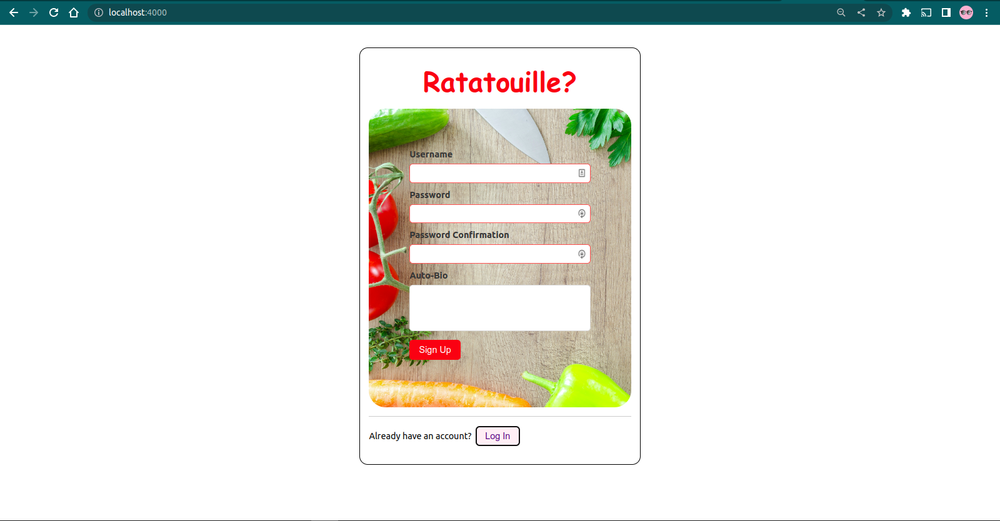
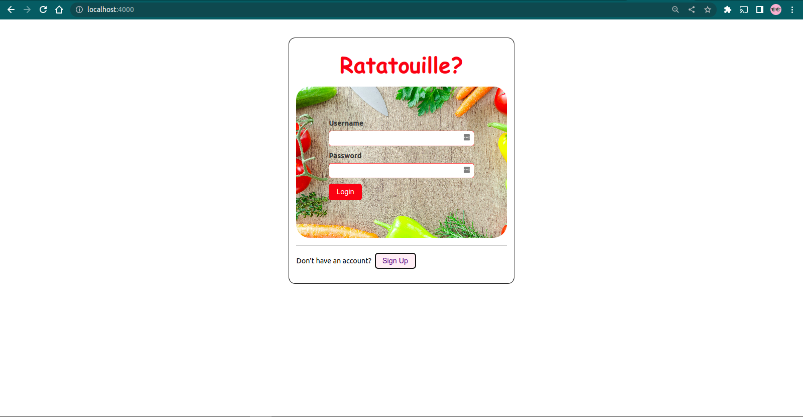
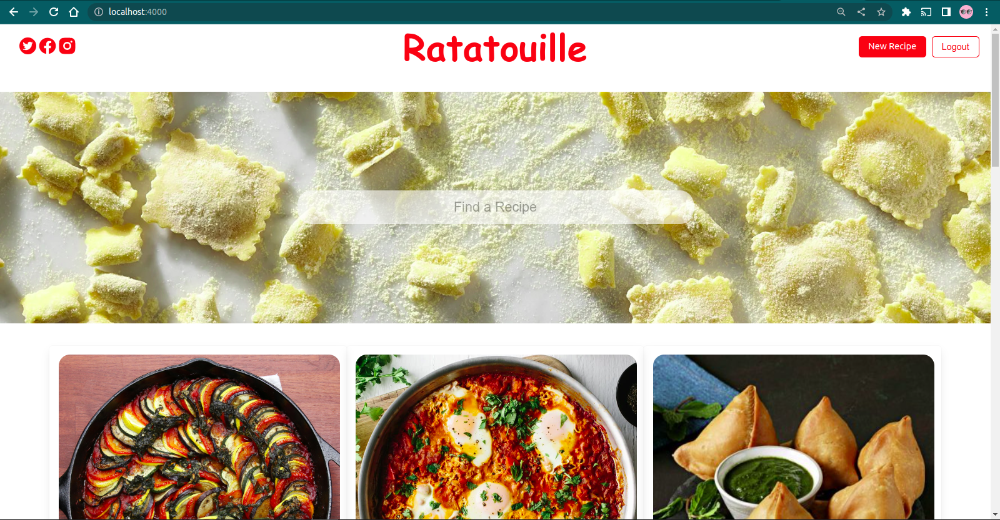
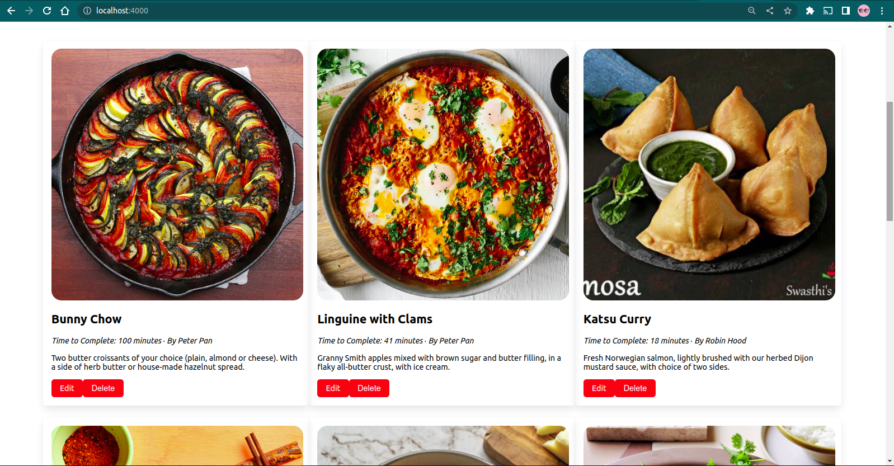
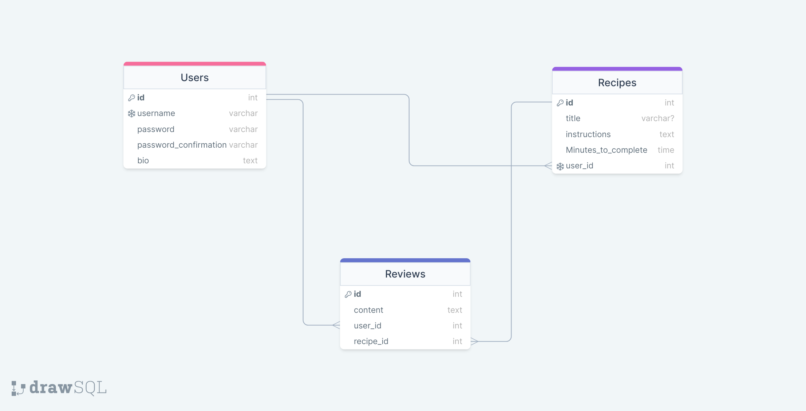

# RATATOUILIE

### By Authors below:-

# Table of Contents

​- [RATATOUILIE](#ratatouilie)
    - [By Authors below:-](#by-authors-below-)

- [RATATOUILIE](#ratatouilie)
    - [By Authors below:-](#by-authors-below-)
- [Table of Contents](#table-of-contents)
  - [Description](#description)
  - [Technologies Used](#technologies-used)
    - [Front-End​](#front-end)
    - [Back-End](#back-end)
  - [Project Preview](#project-preview)
  - [Overview](#overview)
  - [ERD showing table relationship](#erd-showing-table-relationship)
  - [Setup](#setup)
  - [License](#license)
  - [Authors](#authors)

## Description

​
Ratatouille is here to make cooking wonderful dishes more enjoyable and less stressful. For home cooks, by home cooks, we provide recipes and culinary guidance. We're all about assisting with "kitchen wins." Although we prefer to utilize fresh, unprocessed ingredients in our recipes, we do acknowledge that canned, frozen, and other prepared foods have their place and time in certain dishes. We support a diet rich in a range of foods, such as whole milk, real butter and cream, extra virgin olive oil, eggs, lots of fruits and vegetables, and protein from dairy, meat, fish, and beans. additional dessert cake
​

## Technologies Used

### Front-End​

- ReactJS - used in the front-end to build interactive user interface
- CSS - to style and design of the website
- React-icons to display the socials
  
### Back-End

- Ruby on rails for backend
- PostgreSQL for database
​

## Project Preview

​
Once a user signs up and/ is logged in, they are able to search for a recipe, create a new one, edit and delete plus leave a review on a particular recipe. Moreover, they are able to view their reviews on each recipe built.
​

## Overview

​

​

​




## ERD showing table relationship

​


## Setup

​
Below are steps required to run this project:
​
For front-end:-

```bash

Clone or fork the project repository
​
$ npm install - to install required dependencies
$ npm start - to get react-app running on a browser

```

For back-end:-

```bash
bundle install to run bundler and get all the gems
rails s to start the rails server sync with front-end
```

​

## License

​
[MIT](https://choosealicense.com/licenses/mit/) CopyrightⒸ 2022 RATATOUILIE.
​

## Authors

​

- [Adams Wonderboy](https://github.com/adamswonder) - Scrum master
- [Nana Olomaiyani](https://github.com/olomaiyani) - Front-end Developer
- [Victor Muhita](https://github.com/Vicstudentwatch) - Front-end Developer
- [Cyntia Njomo](https://github.com/CynthiaNgoiri) - Back-end Developer
- [Daniel Gathemia]() - Front-end Developer
